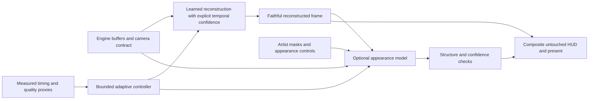
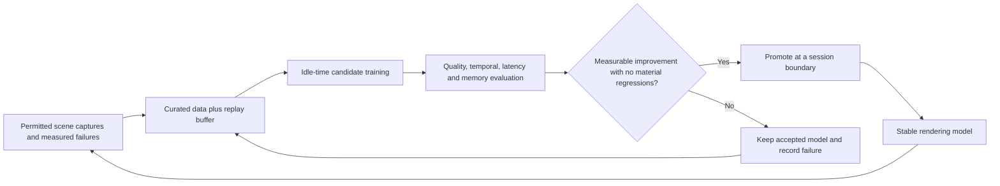

# SI-GPU: a research path toward DLSS 5 competition

Research date: October 5, 2026. Software-only project; primary display 2560x1440, secondary 1920x1080. This is a proposed research strategy, not a demonstrated parity claim or a promised release date.

## What we are competing with

NVIDIA describes DLSS 5 as a generative appearance stage. Its published summary specifies one-step pixel-space diffusion conditioned on frame color, engine motion, temporal state and art-direction values, with renderer-derived consistency supervision during training. This expands the target beyond reconstruction to controlled lighting/material enhancement. [NVIDIA research summary](https://research.nvidia.com/labs/adlr/DLSS5/)

Developer controls include model selection, structure/tone adjustment and semantic/engine masks. These are relevant product requirements for an appearance model, not merely image-quality settings. [NVIDIA developer briefing](https://developer.nvidia.com/blog/whats-new-for-game-developers-dlss-5-with-3d-guided-neural-rendering-nvidia-ace-updates-and-new-rtx-kit-capabilities/)

NVIDIA's published launch support covers RTX 50-series hardware and GeForce NOW. Treat that as the verified supported route for DLSS 5 comparison, rather than community modifications on older cards. [NVIDIA launch information](https://www.nvidia.com/en-us/geforce/news/dlss-5-3d-guided-neural-rendering/)

DLSS Super Resolution remains an independently useful reconstruction comparator: NVIDIA documents DLSS 4.5 Super Resolution for all GeForce RTX GPUs, whereas newer frame-generation features have narrower requirements. [NVIDIA Super Resolution information](https://www.nvidia.com/en-us/geforce/news/dlss-4-5-dynamic-multi-frame-gen-6x-2nd-gen-transformer-super-res/)

The linked DLSS 5 technical report returned HTTP 403 during this research session. The architectural statements above come from the accessible official research summary and developer pages; the full report was not reviewed. Marketing statements about quality/stability are vendor claims until confirmed by our own tests. No NVIDIA model weights or leaked binaries are required for the proposed SI-GPU implementation.

## Where SI-GPU stands

SI-GPU 0.3 has original spatial/temporal D3D12 shaders, GPU history, CPU parity, reset/reactive/depth handling, tiled neighborhood processing and monitor-size benchmarks. It has no trained neural reconstruction model, appearance generator, ray reconstruction, frame generation or integrated game/engine scene. CPU/GPU parity verifies the implementation of our algorithm, not competitiveness against NVIDIA.

Recorded 1440p combined median is about 1.43 ms, with p95 about 49 ms under occupied-desktop conditions. These are offline fixed-input dispatch measurements. They cannot be compared with NVIDIA's published whole-game FPS or used as evidence of superior real-time behavior. The timing tail still needs controlled profiling.

## Define success before choosing a model

There are several independent competitions:

| Objective | Proposed evidence |
|---|---|
| Reconstruction fidelity | Matched inputs, display resolution and frame budget; held-out moving scenes; fewer trails, shimmer, disocclusion errors and unreadable details |
| Appearance enhancement | Artist-approved target appearance; blinded preference tests; structure/identity/text preservation; temporal stability |
| Performance | GPU pass and whole-frame p50/p95/p99; memory; startup/stutter; input latency; positive net rendering benefit |
| Accessibility | Verified older-device and second-vendor support with graceful fallback |
| Creative control | Masks and intensity controls behave predictably and default to preserving authored content |

A narrow, supported claim such as “better 1440p foliage reconstruction at the same GPU budget on this device” is a useful first victory. “Better than DLSS 5” needs an explicit domain and comparable results. Support for an older device is a compatibility advantage; it does not prove equal visual quality.

## Recommended architecture: two separate learned capabilities

The reconstruction path must work well without the appearance model. An optional appearance branch makes its extra cost, artistic effect and failures independently measurable. Its initial deployment should focus on one bounded material/effect class; a full-scene general generator comes only after evidence supports it.

These are proposed SI-GPU design decisions, not descriptions of NVIDIA's internal implementation.

## Track 1: competitive reconstruction

1. Integrate the existing GPU shaders into a controlled D3D12 renderer/sample. Acquire correct motion, depth, jitter, exposure and camera matrices. Fix moving-camera depth reprojection and resource lifecycle before training against corrupted history.
2. Capture paired native/low-resolution sequences at identical simulation states, including foliage, hair/thin geometry, fast pans, disocclusions, particles, reflections and fine text. Separate whole scenes/assets into training, validation and locked test sets.
3. Train a compact residual network at render resolution, with a 2x output head and explicit history/confidence input or fusion. Compare a compact CNN with a small attention-equipped candidate at matched cost; model type alone does not establish quality.
4. Use spatial reconstruction, gradient/edge and motion-aligned temporal objectives. Mask invalid/disoccluded history correctly and inspect feedback artifacts over long rollouts. Keep perceptual losses secondary when faithful reconstruction is the intended behavior.
5. Export and profile on the actual 2080 Ti. Test FP16 and memory layouts, then evaluate further compression/distillation only when output parity and quality hold. Make the inference backend decision from integrated timing, not standalone operator speed.
6. Add arbitrary output ratios. Current 2x mode provides 720p to 1440p; a higher-quality 1080p to 1440p mode requires 4/3x support and a separately trained/validated path.
7. Compare with the best available DLSS Super Resolution and a relevant FSR/engine temporal baseline in the same controlled workload. Log exact model/preset/runtime versions and all settings.

This is the nearest practical competition for the current hardware and code. The proposed earlier <=4 ms 1440p combined p95 remains a target to verify, not an achieved result.

## Track 2: controlled neural appearance

1. Choose an initial effect with an explicit target and mask, such as foliage transmission or a bounded indirect-lighting enhancement. Avoid beginning with unconstrained full-scene generative edits.
2. Create owned/permitted paired scenes: economical runtime rendering and an approved higher-quality appearance target. Record material identifiers, normals, depth, lighting state and motion where the renderer supplies them. More samples alone cannot create an authored appearance target that is absent from the assets/material system.
3. Establish a deterministic compact residual predictor first. Compare it with a distilled one-step generative candidate only if the simpler approach fails the desired appearance goal. A teacher model, if used, needs documented rights and its own structural/temporal checks.
4. Condition generation on scene information and explicit strength/mask controls. Use temporal consistency, geometry/edge and semantic/identity preservation constraints; do not trust a visually pleasing still frame to prove preservation.
5. Protect HUD, readable text, gameplay indicators and developer-marked regions. Constrain the residual by material/region and expose an immediate faithful-rendering fallback. Low confidence should reduce enhancement strength.
6. Train over sequences and evaluate long rollouts, cuts, shadows, lighting/exposure changes and unseen assets. Deterministic causal inference is a design goal; it does not automatically guarantee temporal stability.
7. Profile inference while the engine is rendering. A “one-step” model can still be expensive. The appearance branch needs an additional budget justified by whole-frame results; it must not be squeezed invisibly into the reconstruction timing claim.

On the 2080 Ti, training compact models on crops is a reasonable experiment. Whether a useful 1440p appearance branch can meet the desired quality/latency budget is unknown. Broader teacher training/generalization may require additional training compute and more diverse data. Do not assume that our present PC can reproduce NVIDIA's complete system.

## Track 3: adaptation, portability and later features

Use the existing GPU passes as fallbacks. Start with a deterministic controller and rate-limited changes among validated modes. Runtime confidence is a calibrated proxy: the native high-quality target is unavailable during gameplay. Evaluate learned control against that controller on held-out workloads.

Broader hardware support, source availability, measured lower memory and granular preservation controls are plausible differentiation goals. None is a demonstrated superiority claim today; verify actual second-vendor execution and compare controls with the competitor's existing functionality.

Ray reconstruction and frame generation are separate later workstreams. Ray reconstruction requires noisy ray-tracing buffers and high-quality lighting truth. Frame generation requires interpolation/extrapolation data, artifact evaluation and input-latency measurement. Generated display FPS must remain separate from rendered simulation FPS. Neither is necessary to start evaluating an appearance module against DLSS 5's additional rendering stage.

AI development assistance can improve experiment selection, profiling and reproducibility outside the rendering loop. Quantum simulation and the project name do not substitute for training data, an efficient model or comparative evidence.

## Fair comparison protocol

For reconstruction, hold output at 2560x1440, match render dimensions and input buffer conventions, and disable appearance enhancement on both paths. Compare at equal GPU budgets and at equal quality targets; publish the resulting tradeoff rather than a single cherry-picked setting. Test both 2x and later quality ratios explicitly.

For appearance, use the same engine base frame and scene controls. Compare enhancement enabled/disabled independently of upscaling, denoising and generated frames. Score artist intent, geometry/identity/text preservation, temporal errors, human preference and cost. PSNR against the unchanged base frame can penalize an intentional appearance change, so it cannot be the sole score for this branch.

Use the officially supported DLSS 5 setup when accessible through an authorized integration. The 2080 Ti can serve as our development/reconstruction target, but the cited launch does not provide a supported local DLSS 5 path on it. Obtain access to a supported comparison machine when a candidate warrants that evaluation; no immediate hardware purchase is necessary to build the lab. If a same-scene comparison cannot be made, label the evidence limited rather than claiming parity from unrelated videos or screenshots.

Keep warmups, full ordered samples, repeat runs, memory accounting, workload state and software versions. Include both success cases and failures. A broader “better” claim requires multiple independent scenes and devices, not CPU parity, PSNR gains on procedural stills or matching feature names.

## Revised milestones

| Release/research gate | Concrete outcome |
|---|---|
| 0.4 | Integrated D3D12 scene, camera/jitter/exposure contract, controlled timing traces and capture harness |
| 0.5 | Compact trained reconstruction model, model card and locked held-out results versus strong baselines |
| 0.6 | Arbitrary quality ratios, DLSS Super Resolution comparison where available and actual second-device validation |
| Appearance experiment A | One masked material/lighting effect, paired targets, deterministic baseline and optional distilled candidate |
| Appearance experiment B | Broader effects only after preservation, temporal and budget gates pass; authorized DLSS 5 head-to-head comparison |
| Later | Ray reconstruction, frame generation and wider engine support as separate measured modules |

The immediate next engineering task remains the 0.4 integration/capture harness. A competitive neural model needs trustworthy engine data, and an appearance model needs approved targets. Our earlier effort estimate concerned a narrow adaptive demonstration; it did not cover recreating the full DLSS suite. There is no responsible date or success guarantee for general DLSS 5 parity at this stage.

## Continuous automated learning proposal

Continuous improvement should become an experimental module alongside rendering. It means a persistent data/evaluation pipeline with repeated candidate training and testing, not uninterrupted weight updates during gameplay. Deployment uses a stable model; training produces separate versioned candidates.

Three learning jobs should remain distinct:

- Hardware adaptation learns timing/memory behavior and selects among validated settings. It can begin with measured experiments on the existing shaders; training image models is not required for this job.
- Reconstruction learning trains on paired low/high-resolution truth, correct motion/depth and useful failure cases. Start with the existing linear filter and then compact neural candidates.
- Appearance learning requires artist-approved targets and preservation checks. Gameplay frames alone do not supply the desired enhanced appearance, and treating the model's own output as unquestioned truth can reinforce errors.

The most important missing input is supervision. An integrated sample can replay a camera path at high quality while idle to create paired truth. Ordinary gameplay telemetry can identify expensive or uncertain frames, but cannot establish the correct high-quality pixels by itself. Teacher-generated targets, if used, must be checked and documented rather than assumed correct.

Use a bounded replay dataset containing both recent failures and representative older scenes. Continual-learning research documents catastrophic forgetting and rehearsal methods; for SI-GPU, mix older data during training and evaluate old scene categories before accepting a candidate. This is a proposed application of the research, not a demonstrated prevention of forgetting in our renderer. [Continual-learning replay research](https://research.google/blog/learning-to-prompt-for-continual-learning/)

Candidate selection should use development/validation scenes, with a separate release holdout. Repeated automated tuning against a single fixed test suite can overfit that suite even if every trial reports a gain. Keep golden correctness regressions, but periodically introduce untouched scene/asset holdouts for generalization assessment.

Promotion gates cover moving image quality, preservation, p95/p99 latency, memory, export parity and old-scene regressions. Set tolerances and minimum meaningful improvements before starting searches. Compare candidates under comparable workload conditions; high desktop interference must not become a false training reward. Keep the previous accepted checkpoint and permit immediate rollback. Hot-swap only at a defined session boundary after resource creation completes.

On the current single 11 GiB GPU, rendering, training and benchmarking compete for resources. Schedule bounded training only during genuine idle periods, suspend it when gameplay begins, check current free VRAM and apply configurable storage/time/thermal budgets. Do not infer available training capacity from total VRAM alone. Data stays local by default; external training resources, if chosen later, are a separate deployment decision.

An initial implementation should create experiment manifests, collect permitted capture pairs, train/evaluate small candidates, produce a comparison report and nominate an accepted version. Automated promotion can follow after this evaluator is trusted. Code/shader search is a separate later workflow, with CPU/GPU parity and resource validation required for every change.

This loop could improve the quality/performance tradeoff and tailor models to recurring workloads. It does not guarantee continuous improvement, general superintelligence or DLSS 5 superiority. Nothing in this proposal starts a scheduled job or persistent learning service; it adds the architecture to the research plan.

## Learning implementation update - October 5, 2026

SI-GPU 0.4.0 now supplies bounded repeated training/evaluation with replay, nomination, offline automatic promotion and rollback. Three original cycles rejected sharper but temporally worse candidates, then accepted a milder offline model. A fresh installed-package run verified automatic promotion. GPU runtime evidence remains deferred under current GPU load. This changes release 0.4 to the learning-lab prototype; the engine/camera integration originally assigned to 0.4 remains the next engineering gate. Neural/appearance models and persistent idle scheduling are not implemented.
