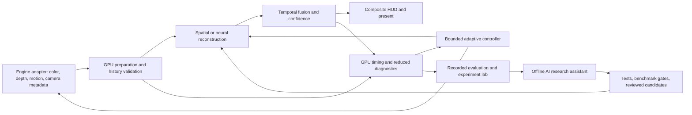

# SI-GPU: software research and implementation plan

Prepared October 5, 2026. SI stands for **superintelligence**. Scope confirmed by the user: **software only**, using existing GPUs.

## Product direction

Build SI-GPU as an adaptive graphics runtime: reconstruct high-quality frames, measure the cost and reliability of reconstruction, and choose among validated settings to meet a user's quality and frame-time goals. Keep SI-WARE as the CPU reference and evaluation laboratory underneath it.

An eventual user chooses a target such as “stable 60 FPS, prioritize image quality.” SI-GPU profiles the supported device, selects a validated reconstruction mode, monitors performance and history reliability, and changes permitted settings conservatively. A diagnostics view explains changes and lets the user lock a preset.

This is a proposal for specialized graphics intelligence. A neural filter, controller, or research assistant does not by itself constitute superintelligence. The name expresses the long-term ambition; capability statements must describe demonstrated behavior. There is no established engineering recipe here for creating general superintelligence.

The first deliverable is a reproducible **2560x1440 primary-monitor demonstration**, with **1920x1080 secondary-monitor validation**, in one controlled engine/sample, on one verified GPU, with a fixed baseline and an adaptive mode. It is not a universal game optimizer. Engine integration must expose rendering buffers; a screenshot-only utility cannot provide the same temporal reconstruction inputs.

## Starting point and gaps

SI-WARE v0.1.1 already has spatial linear reconstruction, temporal history processing, numeric validation, CLI tools, package metadata, reproducible synthetic measurements, and 17 passing tests. At 3x, its learned filter gains about 0.398 dB over bilinear and 0.153 dB over Lanczos on six synthetic still scenes. These are baseline results, not evidence for SI-GPU's eventual quality.

The new constant-depth translation harness detects clean-motion instability. Fix and explain that result before expanding the temporal path. It has no GPU execution, neural model, camera-aware depth reprojection, jitter/exposure pipeline, engine adapter, or intelligent controller. Its 2x/3x/4x integer-scale API also does not support arbitrary render/display ratios.

The archive names an RTX 2080 Ti as the intended first target. That hardware has not been verified in this task. Phase 0 must record the actual GPU, OS build, driver, graphics API support and available memory.

## What the research supports

1. **Temporal reconstruction requires an engine contract.** AMD documents color, depth, motion, exposure, jitter and reactive/composition inputs. This supports building a capture and integration contract before treating temporal upscaling as a plugin for games. [AMD FSR upscaler integration](https://gpuopen.com/manuals/fidelityfx_sdk/techniques/super-resolution-upscaler/)

2. **Gaming reconstruction data should include rendering metadata.** The authors of *Efficient neural supersampling on a novel gaming dataset* describe a dataset with depth, motion, viewport jitter and mipmap settings. The implication for this project is to train and evaluate using engine-derived sequences, with scene-level holdouts. Dataset availability and licensing still need checking before adoption. [Research paper](https://arxiv.org/abs/2308.01483)

3. **Sampling and reconstruction can be optimized together.** Research on neural temporal adaptive sampling and denoising supports investigating adaptive allocation of rendering work. It is path-tracing research, so applying its ideas to SI-GPU is a design inference, not proof of a ready-to-use general game controller. Start with existing engine knobs before attempting per-pixel sampling policies. [NVIDIA research](https://research.nvidia.com/labs/rtr/publication/hasselgren2020neuraltemp/)

4. **Backend choice is changing.** ONNX Runtime marks DirectML as sustained engineering and directs new Windows deployments toward Windows ML. DirectML remains a relevant D3D12 inference option, especially where graphics interoperability matters. [DirectML provider documentation](https://onnxruntime.ai/docs/execution-providers/DirectML-ExecutionProvider.html)

5. **Framework support is not device support.** Windows ML's downloadable providers require compatible OS/device/driver combinations; its NVIDIA catalog currently lists RTX 30-series and above. Standalone TensorRT for RTX documents Turing or later, a different requirement. Do not infer that the Windows ML provider works on the project's proposed 2080 Ti just because another TensorRT product supports its architecture. Pin and smoke-test the exact deployment combination. [Windows ML requirements](https://learn.microsoft.com/en-us/windows/ai/new-windows-ml/supported-execution-providers), [standalone TensorRT RTX requirements](https://docs.nvidia.com/deeplearning/tensorrt-rtx/latest/installing-tensorrt-rtx/prerequisites.html)

6. **Profiling must include the graphics workload.** NVIDIA's GPU Trace supports Turing and newer and provides a way to inspect interactions in the rendering pipeline. Standalone neural inference timing is insufficient to establish net game benefit. [Nsight Graphics GPU Trace](https://docs.nvidia.com/nsight-graphics/UserGuide/gpu-trace-overview.html)

7. **Frame generation is later research.** Space-time supersampling research explores joint reconstruction and extrapolation. Its reported results concern its own experiment, not this project's hardware or model. Keep generated-frame work outside the first release and measure input response separately if added later. [Research paper](https://arxiv.org/abs/2312.10890)

## Proposed architecture

### Frame processing on the GPU

Use C++ and D3D12/HLSL for the initial graphics path. Port the linear filter first to establish numerical parity and buffer interoperability. Add depth-aware motion selection, projection-aware reprojection, jitter handling and history confidence as separately measurable passes.

The proposed neural candidate is a compact residual CNN operating largely at render resolution, with a 2x subpixel output head. Begin with a spatial network plus explicit temporal fusion; compare it with a learned temporal variant only after the explicit path is understood. Candidate channel counts and block counts are experiments, not promised architectures. Train offline in Python; export to ONNX; verify output parity after conversion and precision changes.

Keep color/history on the GPU, preallocate buffers, avoid CPU roundtrips in ordinary rendering, and compile shaders/models before timed playback. An offline upload benchmark may use copies; label it separately from engine integration. Where runtime interoperability requires GPU copies, include their cost and synchronization in the measured pass budget.

The eventual frame contract includes render/display dimensions, texture formats, color space, linear/nonlinear depth convention, motion direction and units, camera matrices, jitter offsets, exposure, reactive regions, frame identifier and reset reasons. Distinguish camera cuts, resize, exposure changes and projection changes. Composite HUD at display resolution after reconstruction. Define pipeline order explicitly and avoid accidentally stacking two temporal antialiasing solutions.

### Intelligence during rendering

Start with a deterministic controller. Observe smoothed GPU time, missed deadlines, motion magnitude, history rejection and calibrated confidence proxies. Ground-truth image error is unavailable during gameplay; proxy confidence must be calibrated against held-out captures.

Initially allow selection among fixed quality presets, history-strength bounds and a limited sharpening range. Add dynamic render resolution only when arbitrary scale and reset behavior are supported. Use hysteresis, minimum dwell times and bounded parameter changes to prevent oscillation. Reset or fall back immediately for invalid buffers and discontinuities.

Compare a learned controller with this deterministic baseline using held-out workloads. Adopt learning only if it measurably improves the quality/performance tradeoff without unstable transitions. Pixel reconstruction can run per frame; model/preset switches should be infrequent. No large language model or online training is required in the frame loop.

### Intelligence during development

An optional AI research assistant proposes experiments, summarizes traces, suggests model/shader candidates and organizes results. It runs outside gameplay. All candidates enter a reproducible test and benchmark pipeline; keep an accepted baseline and rollback path. Training and agent work must not contend with the GPU during a benchmark or game session.

Treat automated experimentation as a later module, after metrics and experiment manifests exist. Start with bounded searches over model sizes, precision and controller parameters. Larger code-generating workflows must earn their place through faster validated iteration, not merely produce more changes.

## Backend decision

| Component | Initial recommendation | Decision gate |
|---|---|---|
| Graphics preparation/fusion | D3D12 compute shaders | CPU/GPU parity; resource synchronization; no hidden readback |
| Training | Python training environment, selected after device audit | Compatible toolchain; reproducible checkpoint; data rights |
| First neural deployment | Test DirectML interoperability and a compatible NVIDIA runtime on the actual target | Whole-pipeline p95, GPU copies, operator coverage, memory and output parity |
| Modern Windows deployment | Evaluate Windows ML where its OS/provider requirements are met | Explicit provider/device matrix; no silent CPU fallback |
| Second vendor | D3D12 shader baseline plus a supported inference provider | Test an actual second GPU; publish restrictions |
| Vulkan | Later portability track | Clear need and available test hardware; extension support queried |

The first backend spike should select one implementation. Do not build multiple production backends before proving the workload. An API abstraction makes later ports possible; it does not establish compatibility by itself.

## Milestones and proposed effort

These are planning estimates for experienced implementation work, not researched delivery guarantees. A total of roughly **220–380 focused hours** is a reasonable budgeting range for the narrow demo below; training, unfamiliar engine/toolchain work and hardware access can increase it. At the earlier project's assumed 10 hours/week, that is roughly 22–38 weeks. Do not carry over the old eight-week release promise. Release the offline lab if integration gates fail.

| Phase | Estimated effort | Deliverable | Exit gate |
|---|---:|---|---|
| 0. Establish target and spec | 10–20 h | Device/runtime manifest; architecture decision; frozen v0.1.1 baseline | Supported toolchain smoke test; 1440p primary and 1080p secondary test configuration; explicit API/engine choice |
| 1. Establish motion truth | 30–50 h | Nonwrapping sequence suite and visual report | Explain/fix clean-motion instability; split whole scenes; correctness on camera cuts and disocclusions |
| 2. GPU baseline | 30–50 h | HLSL spatial/history reconstruction and timestamp profiler | Numerical agreement with accepted CPU reference; measured memory/copies; positive net benefit in sample |
| 3. Neural candidate | 50–90 h | Training harness, compact checkpoint, model card and ONNX export | Held-out quality gain at matched cost; converted model parity; no material visual regressions |
| 4. Engine and adaptive control | 60–100 h | One integrated scene; fixed/adaptive A/B modes; replayable traces | Correct camera/jitter/exposure/HUD behavior; stable controller; whole-frame timing benefit measured separately at 1440p and 1080p |
| 5. Portability and release | 40–70 h | Second-device results, installer/package, rollback, captured demonstration | Clean supported-machine install; explicit device matrix; reproducible measurements |

Phase 1 and a small backend compatibility spike may overlap. Phase 3 must use Phase 1 data; controller and portability claims depend on an integrated GPU path. Quality and speed gates take precedence over dates.

## First demonstration and success criteria

Prioritize the user's main monitor at **2560x1440**; retain **1920x1080** for the secondary monitor.

| Priority | Render input | Display output | Initial mode |
|---|---|---|---|
| Primary monitor | 1280x720 | 2560x1440 | Fixed 2x |
| Secondary monitor | 960x540 | 1920x1080 | Fixed 2x |

Both configurations match the current integer-scale concept and the proposed 2x neural output head. Compare each against native rendering at its own display resolution, using identical inputs and output dimensions across comparison upscalers. Record separate quality, latency and memory results; do not extrapolate 1440p performance from 1080p. The 1440p output has about 1.78 times as many pixels, but actual runtime and memory must be measured.

Later quality modes such as 1920x1080 → 2560x1440 (4/3x) or 1280x720 → 1920x1080 (1.5x) require arbitrary-scale support and are not already present. Validate window resizing, moving the integrated application between monitors, and history resets on output changes. Simultaneous rendering on both monitors is outside the first demo. Treat 4K as a separate measured milestone.

Suggested engineering targets below are proposed gates, not existing results:

- Reconstruction total GPU p95 targets of **4 ms at 2560x1440** and **3 ms at 1920x1080** on the verified first GPU, including preparation, neural inference/fusion, required GPU copies and synchronization. Profile at least 100 warmup frames and 1,000 measured frames across multiple replays; separate shader/model startup costs.
- At least **15% lower median whole-frame time** than native rendering at each corresponding display resolution in the chosen GPU-bound sample, without worse frame-time tails. Also compare the engine's established temporal upscaler; faster than native alone is insufficient differentiation.
- Incremental reconstruction memory targets of **384 MiB or less at 2560x1440** and **256 MiB or less at 1920x1080**, including persistent buffers, activations and runtime workspace. Revise or reject the design based on measured allocation, not array estimates.
- A proposed neural gate of **+0.5 dB mean PSNR over the strongest tested spatial baseline** on a sufficiently varied held-out set, with SSIM, motion-aligned error and visual review. Evaluate per-scene failures separately; average PSNR cannot override obvious ghosting or text damage.
- No material clean-motion instability, persistent trails or unsafe history on required cut/disocclusion sequences. Freeze metric tolerances after repeated baseline runs and before tuning a candidate.
- Controller improves the measured quality/frame-time tradeoff over fixed presets and a simple deterministic policy; no repeated preset oscillation, hidden CPU fallback or disruptive model compilation during playback.

Track reconstruction-pass time, render time, whole-frame p50/p95/p99, memory, CPU submission time and dropped deadlines. An instrumented input event can measure software response, while true input-to-display latency requires a suitable measurement setup. Do not substitute GPU timing for input latency. CPU-bound scenes may have little or no FPS improvement.

## Data and evaluation plan

Use owned/permitted rendered assets and deterministic camera paths. Start with at least eight varied capture sequences: translating geometry, camera pan/rotation, near/far silhouettes, disocclusions, foliage/thin lines, particles/transparency, exposure transitions, and fine text/HUD. Add a scene cut and resolution change to applicable cases.

Capture paired native and low-resolution frames at synchronized simulation states; record camera/motion/depth/jitter/exposure metadata and all rendering settings. High-resolution targets may be temporally supersampled where appropriate, but document how that affects comparisons. Simple image downsampling remains an auxiliary spatial test, not the sole engine training protocol.

Create separate training, validation and locked test scenes before tuning. A starting capture milestone is 3,000 paired frames across the suite, sized according to measured storage and training capacity; this is a minimum infrastructure target, not a claim of adequate diversity. Preserve asset rights, scene IDs, hashes, model/checkpoint metadata and tool versions.

Compare native, bilinear, bicubic/Lanczos, SI-WARE spatial, SI-GPU fixed, SI-GPU adaptive and an engine temporal baseline such as an applicable FSR path. Include visual crops and playback for particles, disocclusions and readable UI. Match output resolution and rendering configuration. Distinguish standard metrics from the lab's custom aligned-error diagnostic.

## Immediate work queue

1. Preserve v0.1.1 and write a versioned SI-GPU specification; keep code renaming separate from algorithm changes.
2. Audit the target GPU/driver/OS and decide the D3D12 sample/engine and supported Python training environment.
3. Replace the wrap-based translation test with nonwrapping motion truth. Diagnose crop/boundary propagation, clipping and history alignment through ablations.
4. Add silhouette and disocclusion captures with visual playback and ground-truth masks. Compare nearest metadata sampling with paired nearest-depth motion dilation.
5. Implement a small HLSL bilinear/linear-filter pass and measure GPU timestamps and CPU/GPU numerical parity at 2x for 1280x720 → 2560x1440 first, then 960x540 → 1920x1080.
6. Test runtime buffer interoperability with one tiny ONNX model on the actual device; record conversion/copy costs and provider assignment before choosing the neural backend.
7. Produce the first decision report: temporal correctness, backend feasibility and measured budget. Proceed to neural training only with a reliable capture/evaluation loop.

The concrete next release, **SI-GPU 0.2**, should contain the upgraded motion lab and a measured GPU baseline. Neural reconstruction, adaptive control and broader deployment follow as separate accepted milestones. This plan does not install software, schedule jobs, alter the existing release or claim that implementation has begun.

## Progress update: October 5, 2026

SI-GPU 0.2.0 delivered the measured D3D12 spatial baseline. SI-GPU 0.3.0 adds GPU temporal fusion and tiled neighborhood processing, with 27 tests and a 216-frame CPU/GPU parity suite plus edge cases. Both monitor sizes are profiled. The p95 performance gates remain unpassed in occupied-desktop runs. Controlled profiling, engine integration, camera/jitter/exposure data, neural reconstruction and adaptive control remain next. Phase 2 is partially achieved, not a passed engine-performance gate. The project remains software-only.

## Quiet-GPU update - October 5, 2026

After the game was exited, three consecutive candidate-specific offline GPU checks passed: combined p95 0.73-0.84 ms at 1080p and 1.08-1.24 ms at 1440p. The experimental runtime registry now accepts the learned candidate. This passes the headless microbenchmark timing gate, while engine integration and whole-frame validation remain pending.
